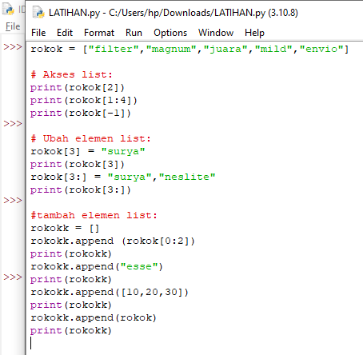
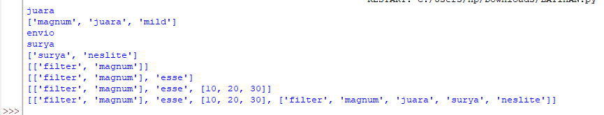
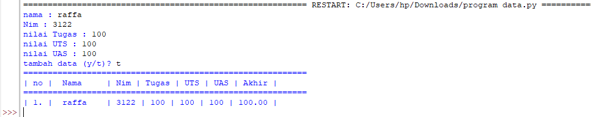

 # praktikum 
## Latihan 5
#### Buatlah sebuah list sebanyak 5 elemen dengan nilai bebas
#### Tampilkan elemen ke - 3
Ambil nilai elemen ke - 2 sampai elemen ke - 4
Ambil elemen terakhir

## Ubah elemen list:
#### Ubah elemen ke - 4 dengan nilai lainnya
Ubah elemen ke - 4 dengan elemen terakhir

## Tambah elemen list:
#### Ambil 2 bagian dari list pertama (A) dan jadikan list ke -2 (B)
Tambah list B dengan nilai string
Tambah list B dengan 3 nilai
Gabungkan list B dengan list A

## Tugas Praktikum 5
#### Buatlah program sederhana untuk menambahkan data kedalam sebuah list dengan rincian:
#### Program meminta memasukkan data sebanyak-banyaknya (menggunakan perulangan)
Tampilkan sebuah pilihan untuk menambah data ^(Y/T)?*, apabila jawaban T (Tidak), maka program akan menampilkan daftar datanya
Nilai akhir diambil dari perhitungan 3 komponen nilai (Tugas : 30%, UTS : 35%, UAS : 35%)
Selamat mengerjakan ^^

## Langkah-langkah
#### Pertama, kita membuat list yang dibuat seperti ini:
NAMA = []
NIM = []
Tugas = []
UTS = []
UAS = []
Total = []

## Setelah sudah membuat list pada variabel diatas kita akan membuat program perulangan agar kita bisa memasukkan data sebanyak-banyaknya
#### while True:
    nama = input('Nama : ')
    NAMA.append(nama)
    nim = int(input('NIM : '))
    NIM.append(nim)
    nTugas = float(input('Nilai Tugas : '))
    Tugas.append(nTugas)
    uts = float(input('Nilai UTS : '))
    UTS.append(uts)
    uas = float(input('Nilai UAS : '))
    UAS.append(uas)
    nAkhir = (int(nTugas) * .3) + (int(uts) * .35) + (int(uas) * .35)
    Total.append(nAkhir)
Membuat program pilihan (Y/T)?, yakni ketika kita menginputkan Y, maka kita akan diminta untuk mengisi data kembali. Tetapi ketika kita menginputkan T, Maka program akan berakhir dengan menampilkan hasil inputan data yang telah kita buat
Kita juga membuat tabel menggunakan peformatan string agar terlihat rapi ^^
lagi = ''
    while lagi != 'Y' and lagi != 'T':
        lagi = input('Tambah data (Y/T) ?')
    if lagi == 'T':
        print('='*58)
        print('| No | \tNama\t |    NIM    | Tugas | UTS | UAS | Total |')
        print('='*58)        
        for i in range (len(NIM)):
            nm = '| %d. | \t%s\t' % (i+1, NAMA[i])
            im = ' | %d' % NIM[i]
            tg = ' | %d' % Tugas[i]
            ut = '    | %d' % UTS[i]
            us = '  | %d' % UAS[i]
            ak = '  | %.2f' % Total[i]
            ov = ' |'
            overall = nm + im + tg + ut + us + ak + ov
            print(overall)

        break
Hasil dari program yang telah dibuat ditampilkan/diekspresikan dan akan jadi seperti ini ketika dijalankan:

## Tampilan Program

